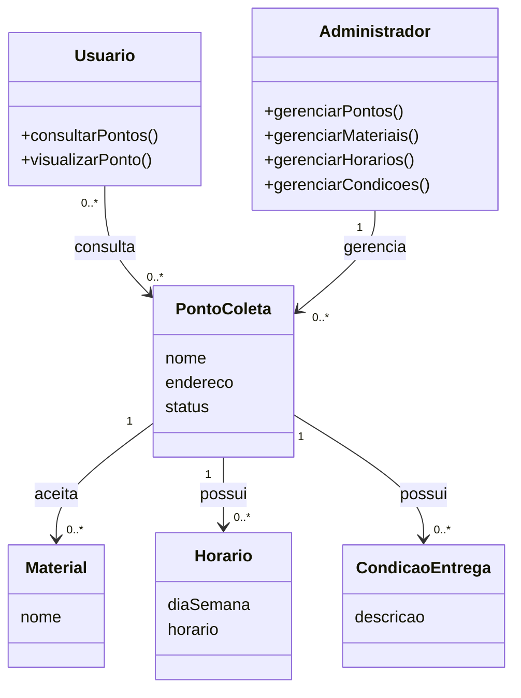

# Modelagem do sistema

> **Artefato central da Sprint 3.** 

## 1. Modelos selecionados

| Modelo | Tipo | Pergunta que ele ajuda a responder | Requisitos relacionados |
|---|---|---|---|
| Fluxo de consulta de pontos de coleta | Comportamental |  Como ocorre a consulta dos pontos de coleta pelo usuário? | RF-01, RF-02, RF-03, RF-04, RF-05 |
| Modelo de domínio dos pontos de coleta | Estrutural | Como os principais elementos envolvidos nos pontos de coleta se relacionam? | RF-01, RF-02, RF-03, RF-04, RF-05, RF-07, RF-08, RF-09, RF-10, RF-11, RF-12 |

## 2. Modelo comportamental em Mermaid

**Descrição e decisões representadas:** O modelo comportamental representa o fluxo principal de consulta de pontos de coleta do Coleta+.

O usuário inicia o fluxo pela página inicial e seleciona a opção para encontrar pontos de coleta. A aplicação direciona o usuário para a página de pontos, que consulta a estrutura de dados da aplicação e apresenta as informações disponíveis.

O modelo foi definido dessa forma porque representa o fluxo atualmente implementado no protótipo e permite relacionar diretamente os requisitos de consulta aos elementos da aplicação.

## 3. Modelo estrutural em Mermaid

**Descrição e decisões representadas:** O modelo estrutural representa, em nível conceitual, os principais elementos envolvidos na organização das informações do Coleta+ e as relações existentes entre eles.

Usuario representa o perfil responsável pela consulta dos pontos de coleta. Administrador representa o perfil responsável pelo gerenciamento das informações disponibilizadas pela aplicação.

PontoColeta representa o local destinado ao recebimento de lixo eletrônico. Material representa os materiais aceitos por um ponto de coleta. Horario representa os horários de funcionamento e CondicaoEntrega representa as condições relacionadas à entrega dos materiais.

O modelo indica que usuários podem consultar pontos de coleta, enquanto administradores são responsáveis pelo gerenciamento dessas informações. Um ponto de coleta pode estar associado a diferentes materiais, horários e condições de entrega.

A modelagem foi mantida em nível conceitual para representar o domínio da solução sem antecipar decisões específicas de implementação, como banco de dados, API, tecnologias de backend ou estrutura final de classes.

## 4. Relação entre requisitos e modelos

| Requisito | Elemento do modelo | Como está representado | Alteração provocada no backlog/código |
|---|---|---|---|
| RF-01 | Usuario / PontoColeta | Usuário consulta os pontos de coleta disponíveis | #31 / #33 |
| RF-02 | Material | Materiais aceitos são representados como elementos associados ao ponto | #32 / #33 |
| RF-03 | Horario | Horários de funcionamento são representados como elementos associados ao ponto | #32 / #33 |
| RF-04| CondicaoEntrega | Condições de entrega são representadas como elementos associados ao ponto | #32 / #33 |
| RF-05 | PontoColeta | A localização é representada pelo elemento PontoColeta | #31 / #32 / #33 |
| RF-07 | Administrador / PontoColeta | Administrador gerencia o cadastro de pontos de coleta | #32 |
| RF-08 | Administrador / PontoColeta | Administrador gerencia as informações dos pontos | #32 |
| RF-09 | PontoColeta | O estado do ponto é representado pelo atributo status | #32 / #33 |
| RF-10 | Administrador / Material | Administrador gerencia os materiais associados aos pontos | #32 |
| RF-11 | Administrador / Horario | Administrador gerencia os horários associados aos pontos | #32 |
| RF-12 | Administrador / CondicaoEntrega | Administrador gerencia as condições associadas aos pontos | #32 |

## 5. Correspondência entre modelo e código

| Elemento modelado | Arquivo/diretório correspondente | Observação |
|---|---|---|
| **Usuário** | [index.html](../../src/index.html) | Representa o ator que inicia a consulta dos pontos de coleta |
| **Administrador** | [requisitos.md](../requisitos/requisitos.md) | Perfil responsável pelo gerenciamento dos pontos e informações associadas, previsto nos requisitos e representado no modelo estrutural |
| **Página Inicial** | [index.html](../../src/index.html) | Página utilizada para iniciar o fluxo de consulta |
| **Página de Pontos** | [pontos.html](../../src/pontos.html) | Página utilizada para apresentar os pontos de coleta |
| **Estrutura de dados dos pontos** | [pontos.js](../../src/pontos.js) | Contém a estrutura organizada dos pontos de coleta e suas informações associadas. |
| **PONTO_COLETA** | [pontos.js](../../src/pontos.js) | Representado pelos objetos da estrutura pontosColeta. |
| **MATERIAL** | [pontos.js](../../src/pontos.js) | Representado pela propriedade materiais de cada ponto de coleta. |
| **HORARIO** | [pontos.js](../../src/pontos.js) | Representado pela propriedade horarios de cada ponto de coleta. |
| **CONDICAO_ENTREGA** | [pontos.js](../../src/pontos.js) | Representado pela propriedade condicoes de cada ponto de coleta e exibido na interface. |

## 6. Refinamentos identificados

- Fluxo de consulta: O fluxo de consulta foi detalhado para representar a navegação entre a página inicial e a página de pontos.
- Organização de dados: A modelagem evidenciou a necessidade de organizar os dados dos pontos de forma estruturada para facilitar a evolução da aplicação nas próximas sprints.
- O atributo status foi incluído em PontoColeta para representar conceitualmente a situação de disponibilidade do ponto.
- A modelagem estrutural foi mantida em nível conceitual para evitar antecipar decisões de implementação que serão tratadas nas próximas etapas do projeto.
- Organização da implementação: A estrutura de dados dos pontos de coleta foi separada do código de apresentação, passando a ser mantida em src/pontos.js. Essa alteração aproxima a implementação do modelo estrutural definido na Sprint 3 e facilita futuras evoluções da aplicação.

## 7. Histórico de atualização

| Sprint | Modelo alterado | Motivo | Evidência |
|---|---|---|---|
| Sprint 3 | Modelo comportamental — fluxo de consulta de pontos de coleta | Representar a sequência de interações realizadas pelo usuário durante a consulta dos pontos | #31 |
| Sprint 3 | Modelo estrutural — domínio dos pontos de coleta | Representar os principais elementos e relacionamentos envolvidos nos pontos de coleta | #32 |
| Sprint 3 | Estrutura de dados e fluxo de consulta | Adequar a implementação aos modelos definidos na Sprint 3 | #33 |
| Sprint 3 | Documentação da modelagem e rastreabilidade | Registrar os modelos, relacionamentos e evidências da sprint | #34 |

