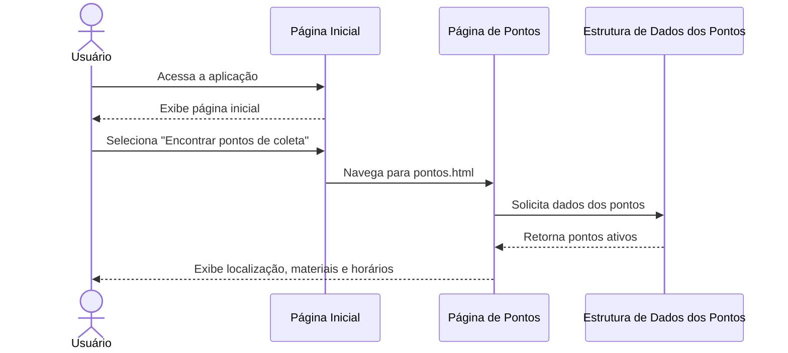
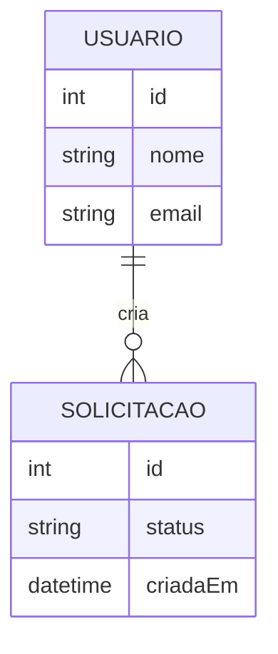

# Modelagem do sistema

> **Artefato central da Sprint 3.** Os modelos devem explicar a estrutura e o comportamento da solução e corresponder aos requisitos e ao código.

## 1. Modelos selecionados

| Modelo | Tipo | Pergunta que ele ajuda a responder | Requisitos relacionados |
|---|---|---|---|
| Fluxo de consulta de pontos de coleta | Comportamental |  Como ocorre a consulta dos pontos de coleta pelo usuário? | RF-01, RF-02, RF-03, RF-04, RF-05 |
| `[Nome]` | Estrutural | `[Como dados ou elementos se relacionam?]` | `RF-XX` |

## 2. Exemplo de modelo comportamental em Mermaid

> Substitua pelo modelo real. O Mermaid é renderizado pelo GitHub e permanece versionado junto ao projeto.

**Descrição e decisões representadas:** O modelo comportamental representa o fluxo principal de consulta de pontos de coleta do Coleta+.

O usuário inicia o fluxo pela página inicial e seleciona a opção para encontrar pontos de coleta. A aplicação direciona o usuário para a página de pontos, que consulta a estrutura de dados da aplicação e apresenta as informações disponíveis.

O modelo foi definido dessa forma porque representa o fluxo atualmente implementado no protótipo e permite relacionar diretamente os requisitos de consulta aos elementos da aplicação.

## 3. Exemplo de modelo estrutural em Mermaid

**Descrição e decisões representadas:** `[PREENCHER]`

## 4. Relação entre requisitos e modelos

| Requisito | Elemento do modelo | Como está representado | Alteração provocada no backlog/código |
|---|---|---|---|
| **RF-01** | PONTO_COLETA | Representa os pontos de coleta consultados pelo usuário | #31, #32, #33 |
| **RF-02** | MATERIAL | Representa os materiais aceitos por cada ponto |  #32, #33  |
| **RF-03** | HORARIO | Representa os horários de funcionamento do ponto |  #32, #33  |
| **RF-04** | CONDICAO_ENTREGA | Representa as condições de entrega associadas ao ponto | #32, #33 |
| **RF-05** | PONTO_COLETA | O endereço representa a localização do ponto | #31, #32 e #33 |
| **RF-07** | PONTO_COLETA | Representa a estrutura necessária para cadastro de um ponto | #32 |
| **RF-08** | PONTO_COLETA | Representa os dados que podem ser alterados | #32 |
| **RF-09** | PONTO_COLETA.ativo | O atributo ativo representa a situação do ponto | #32, #33 |
| **RF-10** | MATERIAL | Representa os materiais associados aos pontos | #32 |
| **RF-11** | HORARIO | Representa os horários associados aos pontos | #32 |
| **RF-12** | CONDICAO_ENTREGA | Representa as condições associadas aos pontos | #32 |

## 5. Correspondência entre modelo e código

| Elemento modelado | Arquivo/diretório correspondente | Observação |
|---|---|---|
| **Usuário** | src/index.html | Representa o ator que inicia a consulta dos pontos de coleta |
| **Página Inicial** | src/index.html | Página utilizada para iniciar o fluxo de consulta |
| **Página de Pontos** | src/pontos.html | Página utilizada para apresentar os pontos de coleta |
| **Estrutura de dados dos pontos** | src/pontos.html | Os dados dos pontos estão atualmente representados na própria página |
| **PONTO_COLETA** | src/pontos.html | Os pontos de coleta apresentados na aplicação |
| **MATERIAL** | src/pontos.html | Materiais aceitos apresentados para cada ponto |
| **HORARIO** | src/pontos.html | Horários de funcionamento apresentados para cada ponto |
| **CONDICAO_ENTREGA** | src/pontos.html | Elemento previsto no modelo para representar as condições de entrega |

## 6. Refinamentos identificados

- Fluxo de consulta: O fluxo de consulta foi detalhado para representar a navegação entre a página inicial e a página de pontos.
- Organização de dados: A modelagem evidenciou a necessidade de organizar os dados dos pontos de forma estruturada para facilitar a evolução da aplicação nas próximas sprints.
- Disponibilidade do ponto: O atributo ativo foi incluído no modelo estrutural para representar a disponibilidade do ponto de coleta conforme a regra de negócio RN-02.

## 7. Histórico de atualização

| Sprint | Modelo alterado | Motivo | Evidência |
|---|---|---|---|
| Sprint 3 | Modelo comportamental — fluxo de consulta de pontos de coleta | Representar a sequência de interações realizadas pelo usuário durante a consulta dos pontos | #31 |
| Sprint 3 | Modelo estrutural — domínio dos pontos de coleta | Representar os principais elementos e relacionamentos envolvidos nos pontos de coleta | #32 |
| Sprint 3 | Estrutura de dados e fluxo de consulta | Adequar a implementação aos modelos definidos na Sprint 3 | #33 |
| Sprint 3 | Documentação da modelagem e rastreabilidade | Registrar os modelos, relacionamentos e evidências da sprint | #34 |

